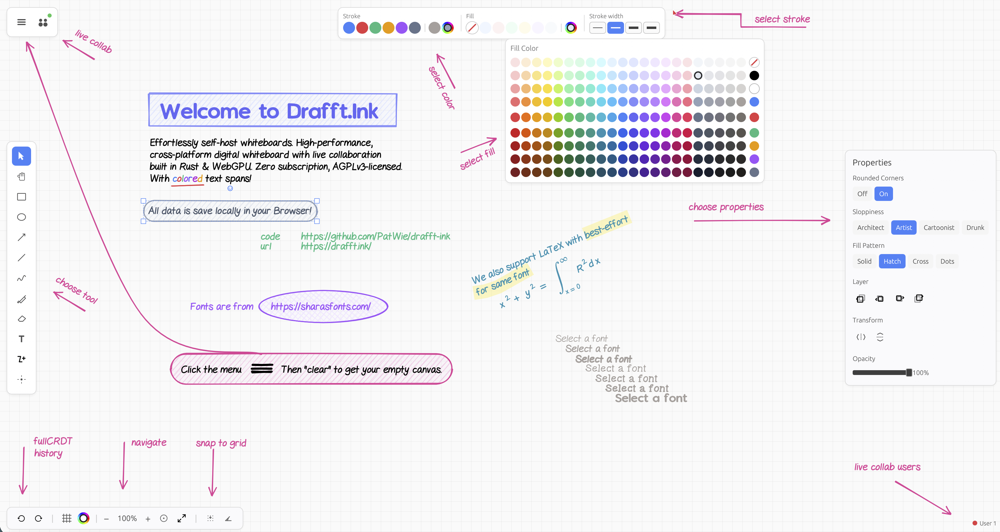

# Drafft.ink

**An infinite canvas whiteboard that respects your time, your data, and your wallet.**

Try it now: [drafft.ink](https://drafft.ink/)

---

## What Is This?


A digital whiteboard built with Rust and WebGPU. Real-time collaboration included. No account required. No subscription fees. No "please upgrade to Pro to unlock the color blue."

Works on desktop (Linux, Windows, macOS), in your browser, and on mobile. Same codebase, same performance, everywhere.

<br clear="left"/>



---

## Why Does This Exist?

Because every whiteboard app eventually asks for your credit card. Because "self-hosted" shouldn't mean "good luck with our 47 microservices." Because somewhere, a PM decided that drawing a rectangle should require a monthly fee.

I wanted a whiteboard I could actually own. It didn't exist, so I built one.

---

## Features

- **Cross-platform** - Native desktop or browser. Pick your poison.
- **Real-time collaboration** - Watch your colleagues draw boxes around things that don't need boxes.
- **Touch support** - Works on iPad. Yes, even yours.
- **Open formats** - Export to PNG or JSON. Import them back. Your data has a passport.
- **Self-hostable** - One binary. One command. No Kubernetes degree required.
- **No telemetry** - We don't know what you're drawing, and frankly, we don't want to.

---

## Installation

### Desktop

```bash
git clone https://github.com/drafft-ink/drafft-ink.git
cd drafft-ink
cargo run --release
```

Or use the build script:

```bash
./build.sh --native
```

### Web (Local)

The hosted version lives at [drafft.ink](https://drafft.ink/). To run locally:

```bash
./build.sh --wasm
```

### Collaboration Server

```bash
cargo build --release -p drafftink-server
./target/release/drafftink-server
```

Listens on `ws://localhost:3030/ws`. That's it. No YAML files were harmed.

---

## Tech Stack

- **Rust** - Because life is too short for null pointer exceptions.
- **WebGPU/Vello** - GPU-accelerated 2D rendering. Silky smooth on 4K displays.
- **egui** - Immediate mode GUI that doesn't fight you.
- **Loro** - Next-gen CRDT for conflict-free collaboration. Your edits and your coworker's edits can coexist peacefully.
- **Parley** - Modern text layout engine. Fonts actually render correctly.
- **roughr** - Hand-drawn sketch style. Because sometimes perfect lines feel wrong.
- **kurbo** - 2D geometry primitives from the people who know what a Bezier curve actually is.

---

## Philosophy

Your tools should work for you, not the other way around.

This project will never:
- Require an account to use
- Hide features behind a paywall
- Phone home with your data
- Make you watch an ad before you can draw a rectangle
- Send you emails about "exciting new features"
- Pivot to AI-generated sticky notes

---

## Contributing

Found a bug? Have an idea? PRs welcome. The code is right here, not behind a sales call.

---

## License

**AGPLv3** - Use it, modify it, host it. Just keep it open.
